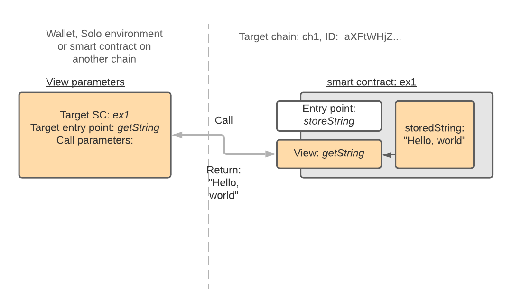

# Exploring IOTA Smart Contracts

Previous: [Invoking smart contract. Sending a request](06.md)   

## Calling a view from the Solo environment
The statement in the above example calls a view entry point `getString` of the smart contract `example1` without parameters:
```
res, err := chain.CallView("example1", "getString")
```
The call returns a result res, a collection of key/value pairs and error (if not `nil`).



The basic principle of calling a view is similar to the sending a request to the smart contract. 
The essential difference is that calling a view is not a transaction but just a synchronous call 
to the view entry point function, exposed by the smart contract.

Naturally, calling a view doesn't involve any token transfer. 
Sending a request (a transaction) to a view entry point will result in an exception. It will return 
all attached tokens back to the sender (minus fees, if any).

Views are used to retrieve information about the state of the smart contract, 
for example to display it on a website. Certain _Solo_ methods such as `chain.GetInfo`, 
`chain.GetFeeInfo` and `chain.GetTotalAssets` call views of the core smart contracts behind scenes 
to retrieve the information about the chain or a specific smart contract.

### Decoding results returned by _PostRequest_ and _CallView_
The following is the technicality of the Go environment of _Solo_.

The result returned by the call to the entry point from the _Solo_ environment is in the form of key/value pairs, 
the `dict.Dict` type. 
It is an extended interface and alias of the `map[string][]byte`. 
The [dict.Dict](https://github.com/iotaledger/wasp/blob/master/packages/kv/dict/dict.go) package implements 
`kv.KVStore` interface and provides a lot of useful functions to handle this form of key/value storage.

In normal operation of smart contracts one can only retrieve results returned by view calls, 
since view calls are synchronous. 
On the other hand, sending a request to a smart contract is an asynchronous operation, and 
the caller cannot retrieve the result. 
However, in the _Solo_ environment, the call to `PostRequest` is synchronous, and the caller can inspect 
the result: this is a convenient difference between the mocked _Solo_ environment and a 
distributed Value Tangle ledger used by Wasp nodes. 
It can be used to make assertions on the result of the call in the test.

The example `res` is a dictionary where keys and values are binary slices. The statement
```
counter, exists, err := codec.DecodeInt64(res.MustGet("counter")) 
```
takes the value of the key `counter` from the key value store and attempts to decode it as `int64`.
The decoding returns a possible error value, existence flag and the value itself.
 
Next: [Sending and receiving tokens with the address](08.md) 
