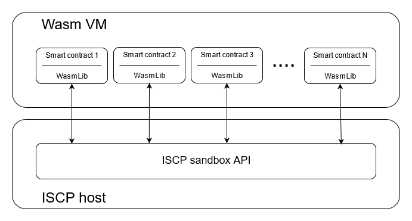

## How to write Smart Contracts for ISCP

The Iota Smart Contracts Protocol (ISCP) provides us with a very flexible way of
programming smart contracts. It does this by providing an API to a sandboxed
environment that allows you to interact with the ISCP in a deterministic way
without any security risks. The API provides a generic way to store, access, and
modify the state of the smart contract. The API can be used by any kind of
Virtual Machine (VM) to implement a system to program, load, and run smart
contracts on top of the ISCP. The actual implementation of such VMs is left to
whomever wants to create one.

Of course, we are providing an example implementation of such a VM to allow
anyone to get a taste of what it is like to program a smart contract for the
ISCP. Our VM implementation uses [WebAssembly](https://webassembly.org/) (Wasm)
code as an intermediate compilation target. The Wasm VM implementation uses the
open source [Wasmtime](https://wasmtime.dev/) runtime environment to be able to
dynamically load and run the Wasm code.

Our choice of Wasm was guided by the desire to be able to program smart
contracts from any language. Since more and more languages are becoming capable
of generating the intermediate Wasm code this will eventually allow developers
to choose a language they are familiar with.

Because each Wasm code unit runs in its own memory space and cannot access
anything outside that memory by design, Wasm code is ideally suited for secure
smart contracts. The Wasm runtime will only provide access to external
functionality that is needed for the smart contract to be able to do their
thing, but nothing more. In our case all we do is provide access to the ISCP
host's sandbox API environment. The way we do that is by providing a simple
library that can be linked into the Wasm code. This library, for obvious
reasons, has been named WasmLib for now.

As you can see we can have any number of smart contracts running in our Wasm VM.
Each smart contract is a separately compiled Wasm code unit that contains its
own copy of WasmLib embedded into it. Each WasmLib provides the ISCP sandbox
functionality to its corresponding smart contract and knows how to access the
underlying smart contract state storage through the VM runtime. This makes ISCP
API access seamless to the smart contract by hiding the details of bridging the
gap between the smart contract's memory space, and the ISCP host's memory space.

The ISCP sandbox environment enables the following functionality:

- Access to smart contract metadata
- Access to parameter data for smart contract function calls
- Access to the smart contract state data
- A way to return data to the caller of a smart contract function
- Access to tokens owned by the smart contract and ability to move them
- Ability to call other smart contract functions
- Access to logging functionality
- Access to a number of utility functions provided by the host

Our initial implementation of WasmLib has been created for the Rust programming
language, because this language had the most advanced and stable support for
generating Wasm code at the time when we started implementing our Wasm VM
environment.

Here is a list of the topics this tutorial will cover:

* [WasmLib Overview](wasmlib/docs/Overview.md)
* [WasmLib Data Types](wasmlib/docs/Types.md)
* [Function Call Context](wasmlib/docs/Context.md)
* [Function Parameters](wasmlib/docs/Params.md)
* [Smart Contract State](wasmlib/docs/State.md)
* [Token Transfers](wasmlib/docs/Transfers.md)
* [View-Only Functions](wasmlib/docs/Views.md)
* [Limiting Access](wasmlib/docs/Access.md)
* [Calling Functions](wasmlib/docs/Calls.md)
