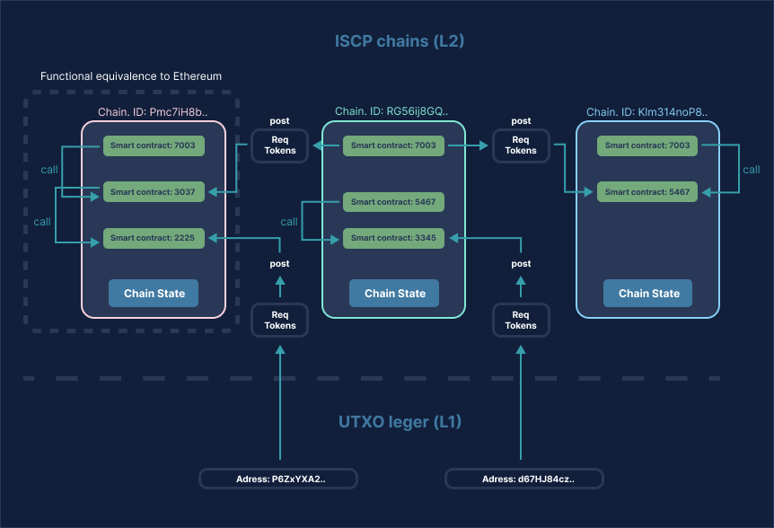

---
keywords:
- ISCP
- Smart Contracts
- Architecture
- Ethereum
- Implementation
description: IOTA Smart Contracts allow anyone to start their own chain and validators. Link to full technical description of the IOTA Smart Contarcts architecture and whitepaper  
image: /img/multichain.png
---
# IOTA Smart Contracts Architecture

With IOTA Smart Contracts, anyone can start their own chain and define the validators.

Each chain has its own state where a state update (going from one block to the next) is hashed and published to the Tangle, which moves the state anchor on Layer 1.

The multi-chain nature of IOTA Smart Contracts makes it a more complex implementation of smart contracts, over say Ethereum, as illustrated here:

The comprehensive overview of architectural design decisions of IOTA Smart Contracts can be found in the 
[whitepaper](https://files.iota.org/papers/ISC_WP_Nov_10_2021.pdf).
