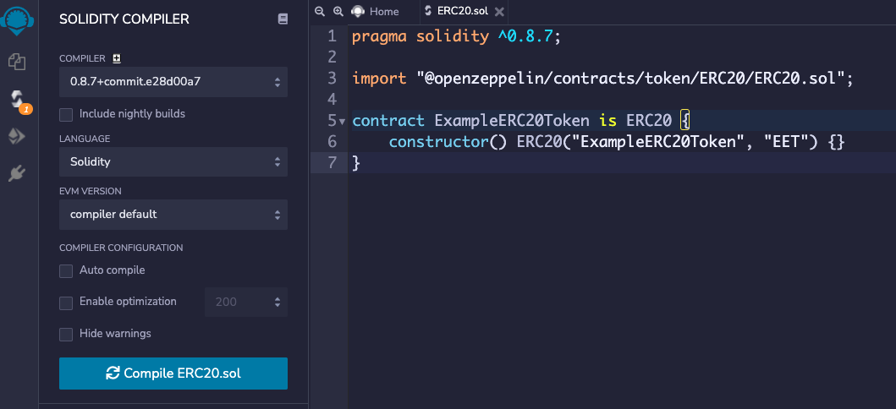
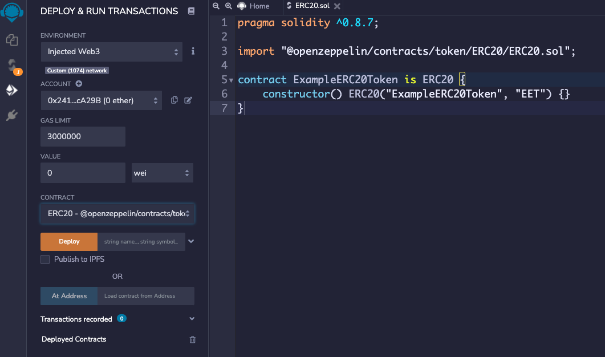

ERC20 is a standard for fungible tokens and is defined in the [EIP-20 Token Standard](https://eips.ethereum.org/EIPS/eip-20) by Ethereum.

With the ERC20 standart you can create your own tokens and transfer them in the EVM on IOTA Smart Contracts without fees.

You can use the [Remix IDE](https://remix.ethereum.org/) to deploy any regular Solidity Smart Contract.
Set the environment to `Injected Web3`, which should then connect with your MetaMask wallet. [See this article](http://localhost:3000/wasp/guide/chains_and_nodes/testnet#interact-with-evm), to learn how connect to your Metamask with the Tesnet.

## 1. Create a Smart Contract

Create a new solidity file, for example `ÈRC20.sol` in the contracts folder of your [Remix IDE](https://remix.ethereum.org/) and add this code snippet:

```solidity
pragma solidity ^0.8.7;

import "@openzeppelin/contracts/token/ERC20/ERC20.sol";

contract ExampleERC20Token is ERC20 {
    constructor() ERC20("ExampleERC20Token", "EET") {}
}
```

This imports all functions from the OpenZeppelin smart contract and creates a new ERC20 token with your name and Symbol. OpenZeppelin provides many audited smart contracts and is a good point to start and learn.

You can change the token name `ExampleERC20Token` and the token symbol `EET`.

## 2. Compile

Go to the second tab and compile your smart Contract with the "Compile ERC20.sol" button.

[](./compile.png)


## 3. Deploy
Go to the next tab and select `Injected Web3` as your environment. Ensure that your MetaMask is installed and setup correctly. 

Press the "Deploy" button - then your MetaMask will popup and you need to accept the deployment. 

[](./deploy.png)