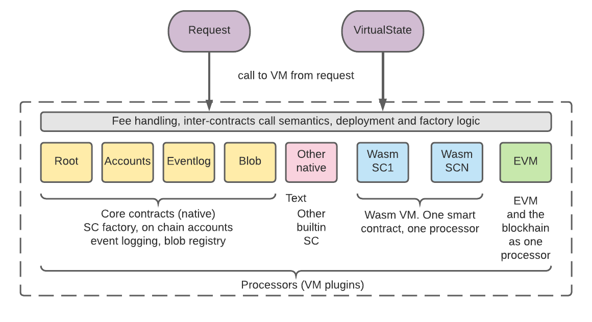

# VM abstraction

## Contents

* General
* The VM
  * Calling the VM
  * Result of running the VM
  * Structure of the VM
  * Deployment of the smart contract
  * VM type
  * Program binary and blob hash
* Processor and the sandbox interface
  * `Sandbox` interface
  * `SandboxView` interface
* Implementation of EVM. A Virtual Ethereum

## General

By _VM abstraction_ in ISCP we understand a collection of abstract interfaces which makes the whole architecture of ISCP and Wasp
node _agnostic_ about what exactly kind of deterministic computation machinery is used to run smart contract programs.

In ISCP we distinguish two things:
* The VM (Virtual Machine) itself
* VM plugins, a pluggable part of VM

The _VM_ itself is a deterministic executable, a "black box", which is used by the distributed part of the protocol,
to calculate output (result) from inputs before coming to _consensus_ among multiple VMs and finally submitting the result it to the ledger as the state update of the chain, the block.  
Naturally, results of calculations, the output, is fully defined by inputs.

The VM contains multiple dynamically attached _VM plugins_ or _processors_.  
The _VM_ invokes _VM plugins_ to perform user-defined algorithms, the smart contracts.  
The _processor_ is attached to the VM through [iscp.VMProcessor](../iscp/vmprocessor.go#L23) interface.  
Each _VM type_ has own implementation of _VMProcessor_ interface.  
Usually, one _processor_ represents one smart contract, however one processor can represent entirely new plugged-in VM, such as EVM.

For more details about implementation of _VMProcessor_ interface see below.

In Wasp node, the VM-related code is mostly located in [wasp/packages/vm](../vm) directory.  
The globally defined data types and definitions are located in [wasp/packages/iscp](../iscp).

## The VM

### Calling the VM
The entry point to the VM in the Wasp codebase is the function [MustRunVMTaskAsync](runvm/runtask.go#L20) function.  
It is called each time the Wasp node needs to run computations.

The function _MustRunVMTaskAsync_ start a parallel goroutine to run calculations.  
Upon completion the VM notifies the calling code through the callback.  
The _MustRunVMTaskAsync_ takes as a parameter [vm.VMTask](taskcontext.go#L19):
```go
type VMTask struct {
	Processors         *processors.ProcessorCache
	ChainInput         *ledgerstate.AliasOutput
	VirtualState       state.VirtualState 
	Requests           []iscp.Request
	Timestamp          time.Time
	Entropy            hashing.HashValue
	ValidatorFeeTarget *iscp.AgentID
	Log                *logger.Logger
	// call when finished
	OnFinish           func(callResult dict.Dict, callError error, vmError error)
	// result
	ResultTransaction  *ledgerstate.TransactionEssence
	ResultBlock        state.Block
}
```
At input, the most important parameters are:
```
	Requests           []iscp.Request
	VirtualState       state.VirtualState 
```
* _VirtualState_ represents current state of the chain, a collection of key/value pairs.
It is _virtual_ in a sense that all updates to that state produced by smart contracts are accumulated in memory
and only are written (committed) into the database upon confirmation of the block

* _Requests_ represents a batch of requests. Each _request_ carries call parameters
as well as attached tokens (digital assets). Each request is processed by a smart contract it is targeting.
The requests update the _virtual state_ sequentially one by one, in each step producing a new virtual state.

### Result of running the VM
The result of running the task by the VM consists of:
* final state of the _VirtualState_
* _ResultBlock_, a sequence of mutations to the _Virtual state_.
* _ResultTransaction_, an _essence_ part (unsigned yet) of the _anchor transaction_ which will be sent to the
Tangle ledger for confirmation.

The _VirtualState_ at the output of the task is always equal to the _VirtualState_ at the output with applied all
mutations contained in the _block_.

The _VirtualState_ has _state hash_ (Merkle root or similar) which is deterministically calculated from the initial _VirtualState_ and the resulting _block_.

The hash of the resulting _VirtualState_ is contained in the _ResultTransaction_, therefore upon confirmation
of the transaction on the Tangle ledger the virtual state is immutably anchored.

### Structure of the VM

The _VM_ wraps many _processors_. The VM wrapper implements fee logic, call between processors, smart contract  
deployment and other generic logic. In general, one _processor_ repesents one smart contract, the VM plugin.  
A _processor_ may implemenent any deterministic calculations as long as it conforms to the _VMProcessor_  
and other related interfaces.



 Significant part of the VM logic is implemented as _core smart contracts_. The core smart contracts also expose  
 core logic of each ISCP chain to outside users: the core smart contracts can be called by requests just like any other  
 smart contract.

 The implementation of core smart contracts is hardcoded into the Wasp. Implementations of all core contract as well  
 as their unit tests can be found in [wasp/packages/vm/code](./core).

 Except core smart contracts, all other processors are plugged into the VM dynamically, hence _VM plugins_.

 All processors are alike: core contracts are attached to the VM just like any other VM plugin.

### Deployment of the smart contract
 The process of plugging a new smart contract (processor) into the VM is called _deployment_. The deployment  
 is handled by sending it the _deployContract_ request to the _root_ contract. As a result of the request,  
 a new smart contract (a _processor_, _VM plugin_) is deployed on the chain. The registry of deployed smart contracts  
 is maintained by the _root_ contract as a part of the chain's state.

 The _deployContract_ request takes two parameters :
* _VM type_ parameter defines interpreter of the smart contract binary code
* _blob hash_ parameter is a hash of the binary (a reference to it) which must be loaded into the interpreter to create a _processor_.
The binary, the blob, must be uploaded into the chain beforehand, usually with IPFS as a uploading/downloading service.

### VM type
All _VM types_ are statically predefined in the Wasp node. It means, to implement a new type of VM plugin, you will need
to modify the Wasp node by adding a new VM type. The _VM type_ is part of _VM abstraction_, so adding a new _VM type_ is transparent to the rest of the Wasp code.

A new _VM Type_ is introduced to the rest of the VM abstraction logic through the call to the function
 [`processors.RegisterVMType`](processors/factory.go#L20).

The call to `processors.RegisterVMType` takes name of the new _VM type_ and the constructor, a function which creates  
new `iscp.Processor` object from the binary data of the program.

The following _VM types_ are pre-defined in the current release of the Wasp:
* `core` represents core contracts
* `native` represents example and other contracts (e.g. the `evmchain` contract) which conform to the native interface and are hardcoded before run
* `wasmtime` represents Wasmtime WebAssembly interpreter and native `Rust/Wasm` environment to create smart contracts.

To implement new types of interpreters, other languages or interpreters, a new _VM Type_
must be implemented into Wasp.

### Program binary and blob hash
To dynamically deploy a smart contract we need code of it in some binary format and dynamical linking of it  
to be able to call from VM. The very idea is to make the binary executable code of the smart contract immutable,  
which means it must be a part of the chain's state.

For example, `WebAssembly` (_wasm_) smart contracts produced by the `Rust/Wasm` environment provided together  
with the Wasp, are represented by `wasm` binaries. Other VM types may take different formats to represent its  
executable code.

To deploy a `wasmtime` smart contract on the chain, first we need to upload the corresponding `wasm` binary.  
All `wasm` binaries (as well as any other files of data) are kept in the registry handled by the `blob` core contract.  
To upload a `wasm` binary to the chain one must send a request to the `blob`. Each blob on the chain is referenced by  
its hash.

The smart contract deployment takes VM type and binary blob hash as parameters. It makes the smart contract  
deployment process completely transparent to the VM types and binary data formats of executables.

The only thing which is needed is to implement is the constructor function for the VM type and register  
it with `processors.RegisterVMType`. The rest is handled by the generic logic of the _VM_.

## Processor and the sandbox interface

In native and `wasmtime` implementations one _processor_ represents one smart contract. It gives full power
to the smart contracts on the ISCP chain, such as manipulate native IOTA assets, call other smart contracts (processors)
on the same chain and send requests and assets to other ISCP chains.

Each processor object implements two simple [interfaces](../iscp/vmprocessor.go#L15): `iscp.VMProcessor`:and `iscp.VMProcessorEntryPoint`.

```go
type VMProcessor interface {
	GetEntryPoint(code Hname) (VMProcessorEntryPoint, bool)
	GetDefaultEntryPoint() VMProcessorEntryPoint 
	GetDescription() string
}

type VMProcessorEntryPoint interface {
	Call(ctx interface{}) (dict.Dict, error)
	IsView() bool
}
```
The smart contract is "plugged" into the _VM_ with this interface.

### Entry points
A processor (smart contract) is a collection of callable _entry points_.

Each entry point is identified in the processor with its `hname` (hashed name), a 4 byte value, normally first 4 bytes
of `blake2b` hash of the smart contract function's name or signature. See [iscp.Hname](../iscp/hname.go#L19).

Function `GetEntryPoint` returns entry point object with the existence flag.

`GetDefaultEntryPoint` must always return default entry point. It will be called each time when entry point
with given `hname` is not found.

`VMProcessorEntryPoint` interface allows to `Call()` the entry point and passes it a context handler.  
The call returns a dictionary of resulting values, a collection of key/value pairs and, optionally, error code.

There are two types of entry points: _full entry points_ and _view entry points_.

* _full entry point_ only accepts context handlers of `iscp.Sandbox` interface type. This type of context
provides full access to the state of the smart contract so that the smart contract could modify it.

* _view entry point_ only accepts context handler of `iscp.SandboxView` interface type. It provides
limited _read-only_ access to the state.

The type of entry point is recognized by `IsView()` function. Using `Call()` with the wrong context type will result
panic in the VM.

The _VM_ provides implementation of `iscp.Sandbox` and `iscp.SandboxView` interfaces. It limits access
to the smart contract's state partition and its on-chain account of tokens.

Each new VM type has to provide its own `VMProcessor` and `VMProcessorEntryPoint` implementations.

### Sandbox interface

The `iscp.Sandbox` [interface](../iscp/sandbox.go) implements a number of functions which can be used by the processor's implementation  
(a smart contract). Here are some of them:

* `Params()` returns a dictionary (key/value pairs) of the call parameters
* `State()` returns access to the `VirtualState` in the context of the call: a collection of key/value pairs.

 All key/value pair storages, like virtual state and call parameters are defined in the [kv package](../kv/kv.go#L19).  
 It defines different kinds of key/value pair collections and different encoding/decoding options for the binary data.

* `Balances()` returns a collection of color/value pairs: balances of colored tokens which are in the control of the
current smart contract
* `IncomingTransfer()` represent colored balances which are coming with this call. Those tokens are already part of `Balances()`
* `Call()` invokes entry point of another smart contract (processor) on the same chain.
Note that the call is agnostic about type of VM of the called entry point.
* `Caller()` is a secure identification of the calling entity: an address or another smart contract
* `Send()` allows sending requests and funds to another chains, smart contracts or ordinary wallets.
* `Utils()` implements a number of utility function which may be called by a smart contract on the VM host.
For example hashing function or other deterministic state-less cryptographic functions which normally are faster
to run on the host than on an interpreter.

### SandboxView interface
The view entry points are called from outside, for example by a web server to query state of specific  
smart contracts. By intention those entry points cannot modify the state of the chain.

The `SandboxView` [interface](../iscp/sandboxview.go) must be passed as a parameter to the view entry points.  
The `SandboxView` implements limited access to the state, fo example it doesn't have a concept of  
`IncomingTransfer` or possibility of `Send()` tokens.  
The `State()` interface provides read-only access to the `VirtualState`.

The logic of the VM ensures that full entry points can call all other entry points, while view entry points can only call  
other view entry points.

## Implementation of EVM on a _Virtual Ethereum_

The IOTA Foundation is contemplating a plan to ensure binary compatibility with EVM/Solidity ecosystem.  
The goal is to be able to run EVM smart contracts on ISCP chains. The EVM should be implemented in the framework of  
the ISCP VM Abstraction.  
The EVM would be implemented as a processor and it will be able to access key/value store of the state through `State()`  
interface of the `Sandbox()`. It essentially means the whole EVM chain would be implemented as a state of one
ISCP smart contract.  
This way EVM would run in an isolated environment and Solidity code won't be able to access and manipulate
native IOTA assets, hence Virtual Ethereum. To open EVM to access all spectrum of ISCP functions
would be the next step.

The Virtual Ethereum project is in the phase of definition therefore it is open for all kind of suggestions
to architectural design with the final goal in mind: to be able to run native EVM code (binary compatibility) as  
a VM on the ISCP chain.

The external interfaces of Virtual Ethereum would be wrapped into the native transactions and calls of IOTA and ISCP.


